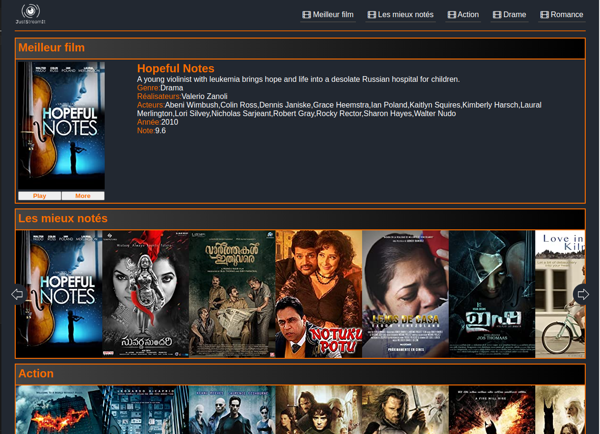
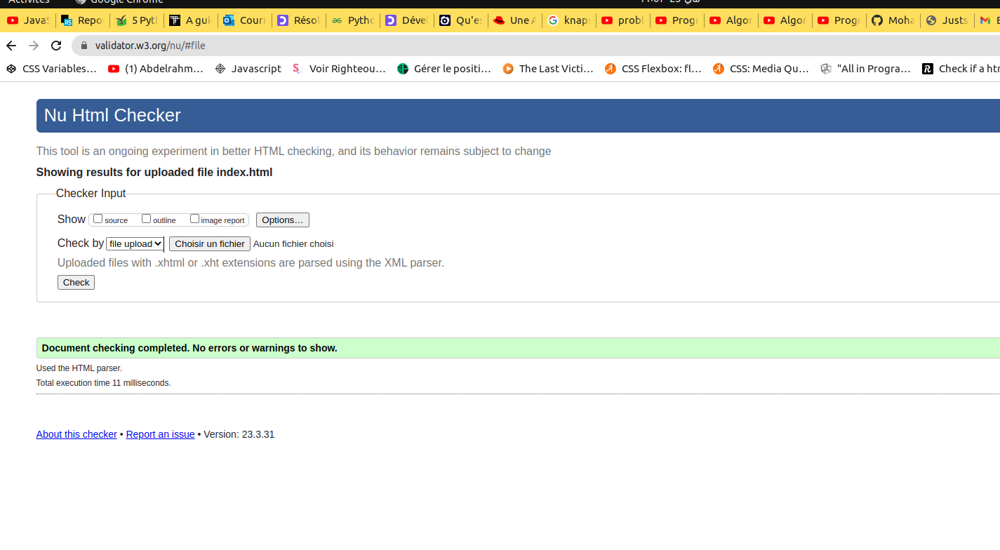
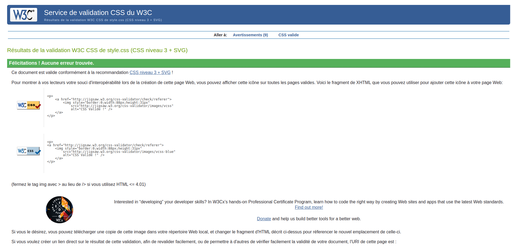

  

# OpenClassrooms - Formation Développeur d'application - Python
# Projet 06
## Développez une interface utilisateur pour une application web Python

## Objectifs

 1. Récupérez les données de l'API REST [OCMovies](https://github.com/OpenClassrooms-Student-Center/OCMovies-API-EN-FR).
 2. Créer une page d'accueil, en utilisant: HTML, CSS et Javascript vanilla.

# Configuration

 1. Clonez ou téléchargez les [API OCMovies](https://github.com/OpenClassrooms-Student-Center/OCMovies-API-EN-FR).
 2. Reportez-vous à la [documentation](https://github.com/OpenClassrooms-Student-Center/OCMovies-API-EN-FR#option-2-installation-and-execution-without-pipenv-using-venv-and-pip ) pour installer et démarrer le serveur localement.
 3. Clonez le projet :
`git clone https://github.com/MohandArezki/P6_MohandArezki_Lahlou.git`

# Usage

Pour accéder à la page, ouvrez le fichier "index.html" dans n'importe quel navigateur Web.

---
Aperçus

Validation du HTML

Validation du CSS

